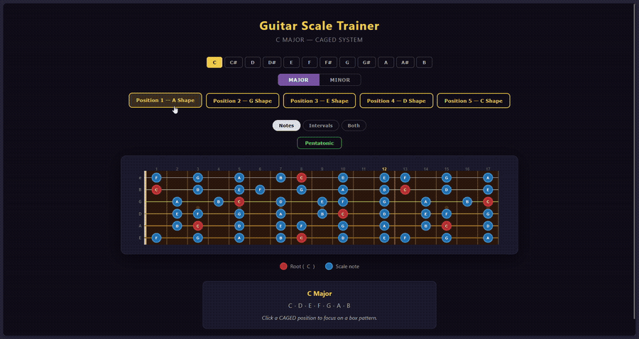

# Guitar Scale Trainer



An interactive fretboard tool for learning and visualising guitar scales using the CAGED system. Built with vanilla HTML, CSS, and JavaScript — no dependencies, no build step.

## Features

- Major and natural minor scales across all 12 keys
- 5 CAGED system box positions per scale (selectable, stackable)
- Pentatonic overlay (major or minor depending on selected scale)
- Three display modes: note names, scale degrees (1–7), or both
- Full-fretboard view by default; click positions to isolate box patterns

## How to use

1. **Pick a key** — click any of the 12 key buttons at the top
2. **Pick a scale** — toggle between Major and Minor
3. **Explore the fretboard** — all scale notes are shown by default; the info card lists the notes of the scale
4. **Focus on a box pattern** — click one or more CAGED position buttons (A Shape, G Shape, …) to highlight specific boxes; non-selected notes dim out
5. **Overlay the pentatonic** — click the Pentatonic button to highlight the 5-note pentatonic subset in green (bright green = root)
6. **Change the label** — switch between Notes, Intervals, and Both using the display buttons

## Installation

### Docker (recommended)

```bash
docker compose up -d
```

Open [http://localhost:8080](http://localhost:8080). To use a different port, change `8080` in `docker-compose.yml`.

### Local development server

Requires Node.js.

```bash
npx serve .
```

Open the URL printed in the terminal (usually [http://localhost:3000](http://localhost:3000)).
